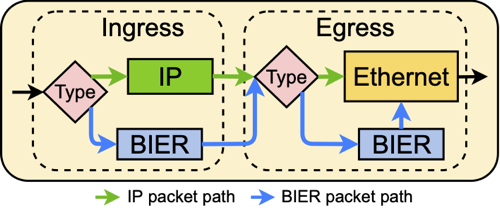

# P4 based implementation of BIER and BIER-FRR

## Repository structure

**Local-Controller:** Contains the local control plane

**src**: Contains the p4 based implementation of BIER and BIER-FRR

## Pipeline



Incoming packets are processed - dependending on their ethernet type - by different control blocks (CB), e.g. IP or BIER.

- IP-CB: src/controls/IP.p4 
- BIER-CB: src/controls/BIER.p4 
- Ethernet-CB: src/controls/Mac.p4


### FRR-Implementation

FRR is implemented based on port monitoring. Tofino generates a special packet when a port goes down (src/controls/Port_Down.p4). This information is saved in a register. Each port corresponds to it's own register index.

```
Register<bit<1>, PortId_t>(2069, 0) port_status_reg;
```

After the CBs are processed, e.g. IP oder BIER, the egress_port is specified. Afterwards, the Port-CB (src/controls/Port.p4) checks if the port is up.

If the port is not up, the corresponding FRR-CBs are processed.

- IP-FRR-CB: src/controls/IP_FRR.p4
- BIER-FRR-CB: src/controls/BIER_FRR.p4
